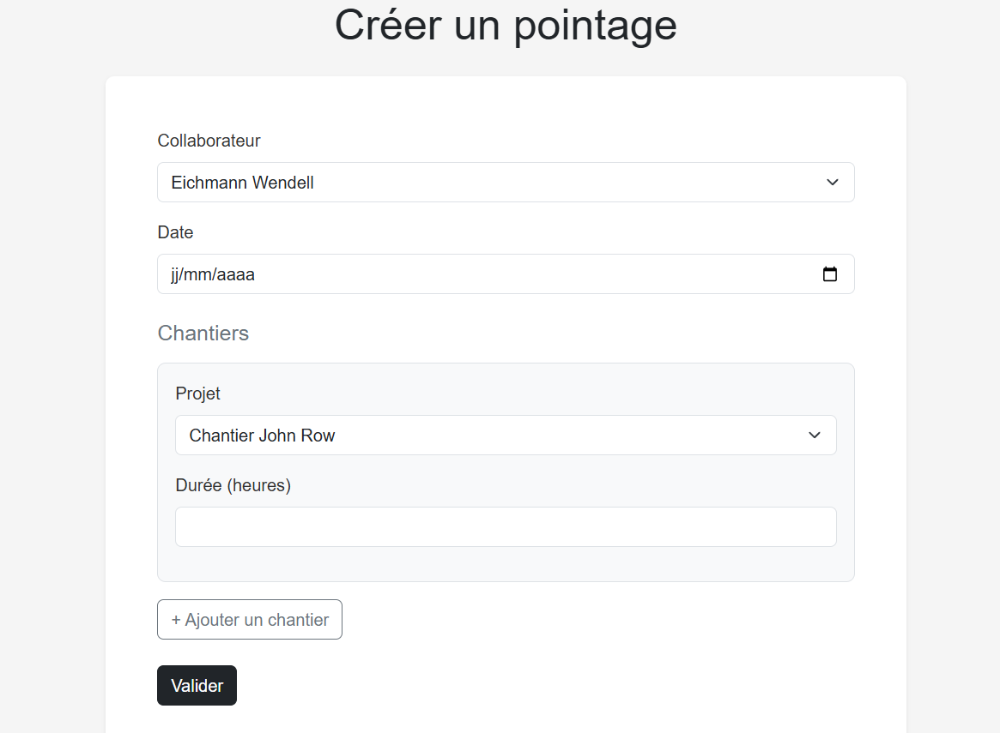
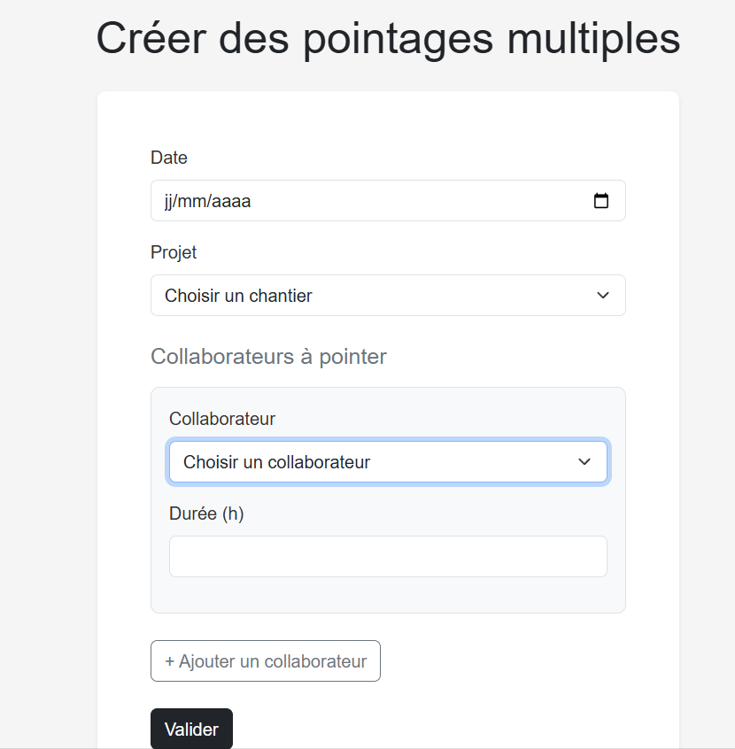
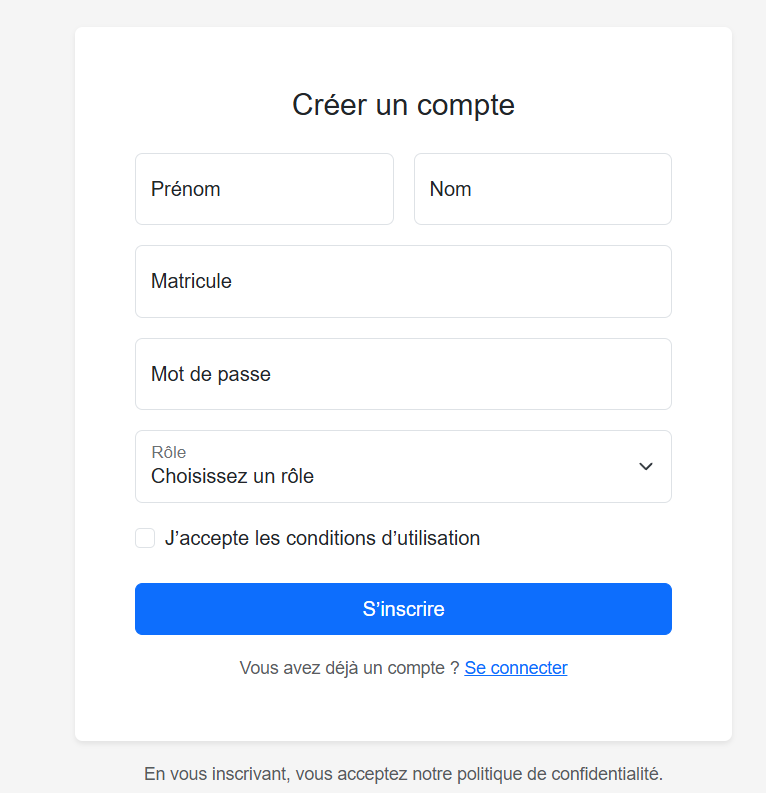
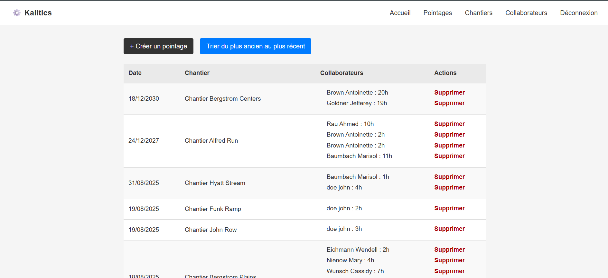

# Test Kalitics fullstack

## Prérequis
* Installer le CLI de symfony
* Préparer une base de donnée SQl (le projet a été créé avec mariaDB)

## Commandes à exécuter
```shell
# Adapter DATABASE_URL dans .env pour votre database SQL
symfony composer install
symfony console doctrine:migrations:migrate

# Pour démarrer le serveur local
symfony serve
```
# Gestion des pointages – Collaborateurs & Chefs de projet

J’ai d’abord fait un premier formulaire de pointage qui permet de choisir un collaborateur (à automatiser), une date, et d’ajouter N lignes (projet + durée).


Puis un formulaire de pointage d’un chef de projet qui a la possibilité de rajouter plusieurs collaborateurs sur un chantier.


Par la suite, j’avais deux boutons pour accéder à ces deux formulaires directement sur la page de pointage, ce qui n’était pas correct. J’ai donc ajouté l’obligation de s’inscrire ou de se connecter pour savoir si l’utilisateur est un collaborateur ou un chef de projet. Il faudrait ensuite supprimer l’auto-inscription et laisser l’admin donner les accès pour rendre cela plus sécurisé.


L’utilisateur aura donc le formulaire adéquat selon son statut.

J’ai aussi rencontré un problème : je n’arrivais pas à voir mes dernières entrées en base dans le tableau de la page pointage. J’ai donc rajouté un bouton qui permet de changer l’ordre des dates (plus récentes ou plus anciennes) pour voir, par exemple, les derniers pointages. Le mieux par la suite serait de créer un filtre plus poussé.


Comme on peut le voir, il y a bien des pointages multiples et des pointages de plusieurs chantiers en une fois par la même personne sur le même formulaire.

J’ai également rajouté un peu de style pour rendre le tout lisible.


Pour la BDD:

Dans la base de donnée, la table user contient id, first\_name, last\_name, matricule, password et roles pour pouvoir savoir si l'user est un collaborateur, un chef de projet ou un admin.

La table project contient id, name, address, date\_start et date\_end . il permet de centraliser les informations des chantiers.

La table clocking contient id, clocking\_user\_id et date, avec une contrainte  sur user et date. Je l’ai faite comme une “feuille du jour” pour un collaborateur afin d’avoir un seul pointage par personne et par jour.

La table clocking\_entry contient id, clocking\_id, project\_id  et duration. Je l’ai séparée pour stocker les lignes  chantier et  durée d’une feuille, ce qui évite de répéter l’utilisateur et la date sur chaque ligne et cela permet d'avoir plusieurs chantiers le même jour.

Cela permet à un collaborateur d’avoir une seule feuille par jour avec plusieurs lignes de chantier, et au chef de projet de créer en une action des feuilles pour plusieurs collaborateurs sur le même chantier et la même date.
